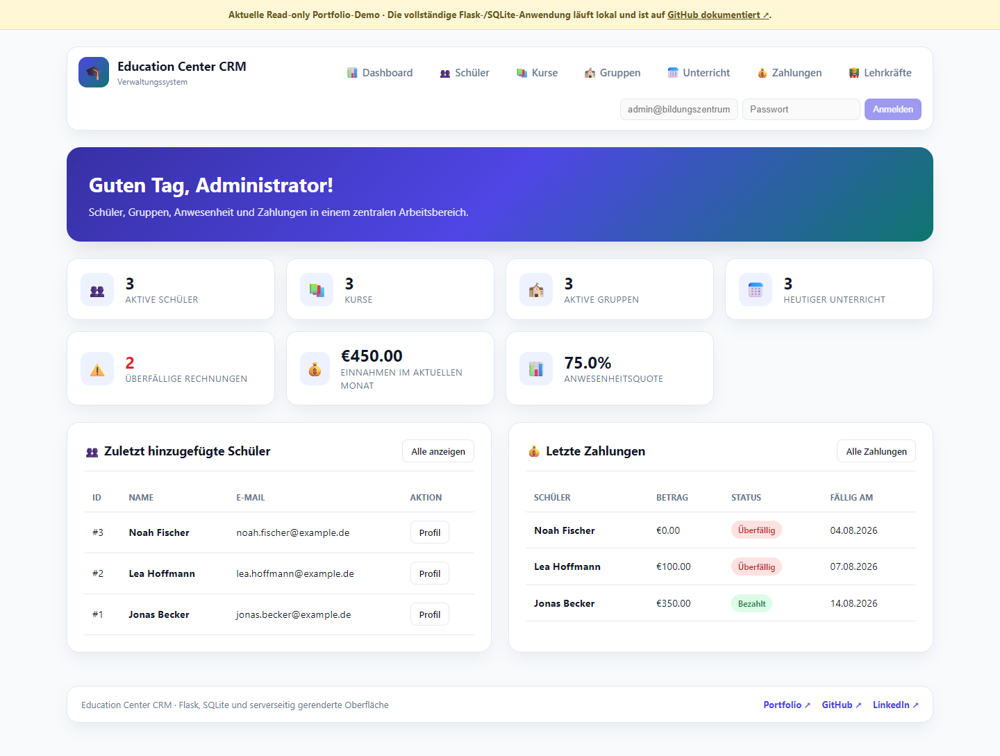

# Education Center CRM



Eine deutschsprachige Flask- und SQLite-Anwendung für die tägliche Verwaltung eines kleinen Bildungszentrums. Das System verbindet Schüler, Lehrkräfte, Kurse, Gruppen, Unterricht, Anwesenheit, Rechnungen und Zahlungseingänge in einer konsistenten Verwaltungsoberfläche.

**Portfolio-Demo:** [Statische Vorschau öffnen](https://sandro-abashishvili.de/education-center-crm/)

Die GitHub-Pages-Version ist eine interaktive, aber schreibgeschützte Vorschau der aktuellen Oberfläche. Die vollständige Anwendung mit Anmeldung, Rollen, Formularen, SQLite-Datenbank und echten Änderungen läuft lokal.

## Aktueller Funktionsumfang

- geschützte Anmeldung mit Werkzeug-Passwort-Hashing
- rollenbasierte Zugriffe für Administrator, Mitarbeiter und Lehrkraft
- Benutzerprofil mit Avatar, Kontodaten und Passwortänderung
- Schülerverwaltung mit Suche, Statusfilter, Detailansicht, Bearbeitung und Löschung
- Lehrkräfteverwaltung mit Suche, Statusfilter, Detailansicht, Bearbeitung und Löschung
- Kursverwaltung mit Suche, Statusfilter, Detailansicht, Bearbeitung und Löschung
- Gruppenverwaltung mit Suche, Statusfilter, Detailansicht, Bearbeitung, Löschung und Teilnehmerzuordnung
- Unterrichtsplanung mit Suche, Statusfilter und Anwesenheitserfassung
- Rechnungs- und Zahlungsverwaltung mit Suche, Statusfilter, Detailansicht, Bearbeitung, Löschung und Teilzahlungen
- automatische Kennzeichnung überfälliger Rechnungen
- einheitliche Aktionen `Öffnen`, `Bearbeiten`, `Löschen` in den Verwaltungslisten
- UTF-8-CSV-Exporte für Schüler und Zahlungen
- Dashboard mit Kennzahlen, Unterricht, Gruppenauslastung und aktuellen Datensätzen
- CSRF-Schutz und serverseitige Eingabevalidierung
- responsive Navigation, mobile Datentabellen, adaptive Filterleisten und mobile Formulare
- stabiles Layout ohne seitliches Springen beim Seitenwechsel
- Favicon und Web-App-Metadaten
- SQLite-Backup und Wiederherstellung
- automatisierte Regressionstests

## Rollen

| Rolle | Zugriff |
| --- | --- |
| Administrator | vollständige Verwaltung einschließlich Löschvorgängen |
| Mitarbeiter | tägliche Verwaltung ohne administrative Löschrechte für geschützte Ressourcen |
| Lehrkraft | eigene Gruppen, Unterrichtstermine und Anwesenheit |

## Navigation

Die Hauptnavigation folgt dem Arbeitsablauf:

`Dashboard → Schüler → Lehrkräfte → Kurse → Gruppen → Unterricht → Zahlungen`

Damit stehen Personen zuerst, danach die Bildungsstruktur, anschließend der operative Unterricht und zum Schluss die Finanzen.

## Desktop-Prototyp

Die erste lokale Desktop-Grundlage ist implementiert: eigenes Fenster, benutzerspezifischer Datenordner, leere Ersteinrichtung, Benutzerverwaltung und vollständige ZIP-Sicherung mit bestätigter Wiederherstellung. Ein freigegebener Windows-Installer ist noch nicht verfügbar. Entwicklungsstart, Teststand und verbleibende Schritte stehen in [desktop/README.md](desktop/README.md).

## Lokale Web-Demo starten

```bash
git clone https://github.com/sandroabashishvili/education-center-crm.git
cd education-center-crm
python3 -m venv .venv
source .venv/bin/activate
pip install -r requirements.txt
python3 app/main.py
```

Danach im Browser öffnen:

```text
http://127.0.0.1:5001/
```

### Demo-Konten

| Rolle | E-Mail | Passwort |
| --- | --- | --- |
| Administrator | `admin@bildungszentrum.de` | `admin123` |
| Mitarbeiter | `manager@bildungszentrum.de` | `manager123` |
| Lehrkraft | `teacher@bildungszentrum.de` | `teacher123` |

Diese Zugangsdaten sind ausschließlich für die lokale Portfolio-Demo bestimmt.

## Tests

```bash
pip install -r requirements-test.txt
python3 -m tools.run_tests
```

Die Tests decken unter anderem Anmeldung, CSRF-Schutz, Rollenrechte, Schülerverwaltung, Profilfunktionen, Kurs-, Lehrkraft-, Gruppen- und Zahlungsmanagement, Anwesenheit, Formvalidierung, CSV-Exporte sowie Datenbankoperationen ab.

## Datenbank sichern und wiederherstellen

```bash
python3 -m tools.database_cli backup
python3 -m tools.database_cli restore --from app/backups/education-crm-DATUM.db --confirm
```

Vor einer Wiederherstellung wird eine zusätzliche Sicherung der aktiven Datenbank erstellt und die SQLite-Integrität geprüft.

## Konfiguration

```bash
export CRM_SECRET_KEY="replace-this-outside-local-demo"
export CRM_DB_PATH="/absolute/path/to/crm.db"
export HOST="127.0.0.1"
export PORT="5001"
```

Weitere Werte stehen in [.env.example](.env.example).

## Projektstruktur

```text
app/
├── main.py                 Flask-Konfiguration, Filter und Fehlerbehandlung
├── database.py             SQLite-Schema, Migrationen und Demodaten
├── models.py               Domain-Dataclasses
├── routes.py               Kernrouten, Rollen und Formularaktionen
├── management_routes.py    Detail-, Edit- und Delete-Routen für Verwaltungsobjekte
├── profile_routes.py       Profil, Avatar und Kontoeinstellungen
├── services.py             Datenzugriff und Geschäftsregeln
├── templates/              Jinja-Seitentemplates
├── static/
│   ├── css/                App-, Header-, Profil-, Management- und Polish-Styles
│   ├── js/                 Mobile Navigation, Responsive Tables und Listenfilter
│   └── favicon.svg
└── utils.py                Parsing- und Validierungshelfer

tests/                      automatisierte Regressionstests
tools/database_cli.py       Backup und Restore
docs/                       veröffentlichte GitHub-Pages-Demo
DOCUMENTATION.md             technische und funktionale Projektdokumentation
```

## GitHub-Pages-Demo

`docs/` enthält keine produktive Flask-Anwendung. Die dort veröffentlichte Seite bildet die aktuelle Navigation, Filterleisten, Verwaltungslisten, Aktionsbuttons, Dashboard-Struktur und das responsive Verhalten als statische Portfolio-Vorschau nach.

Schreibaktionen sind dort absichtlich deaktiviert. Die echte CRUD-Logik bleibt der lokalen Flask-Anwendung vorbehalten.

## Responsive Verhalten

Die Oberfläche ist für Desktop, Tablet und Mobilgeräte ausgelegt. Wichtige Breakpoints liegen bei ungefähr `1050px`, `900px`, `600px` und `390px`.

Auf kleineren Geräten werden Navigation, Filter, Metadatenraster, Aktionsbuttons und Tabellen neu angeordnet. Tabellen wechseln in eine cardartige mobile Darstellung, statt horizontal aus dem Viewport zu laufen.

## Dokumentation

Ausführlichere Informationen zu Architektur, Rollen, Seiten, Zahlungslogik, Demo-Abgrenzung und Teststrategie stehen in [DOCUMENTATION.md](DOCUMENTATION.md).

## Status

**Functional Portfolio CRM – aktiv weiterentwickelt.**

Die Anwendung ist als realistische lokale Portfolio-Demonstration funktionsfähig. Lokale Kontenverwaltung, Admin-Wiederherstellung und vollständige Desktop-Sicherungen sind integriert. Ein extern betriebener Dienst benötigt weiterhin eine eigene Planung für Deployment, HTTPS, zentrale Zugänge, Audit-Logging, Monitoring und Datenschutz.

## Autor

Sandro Abashishvili

[Portfolio](https://sandro-abashishvili.de/) · [GitHub](https://github.com/sandroabashishvili) · [LinkedIn](https://www.linkedin.com/in/aleksandre-abashishvili-03417617a/)
