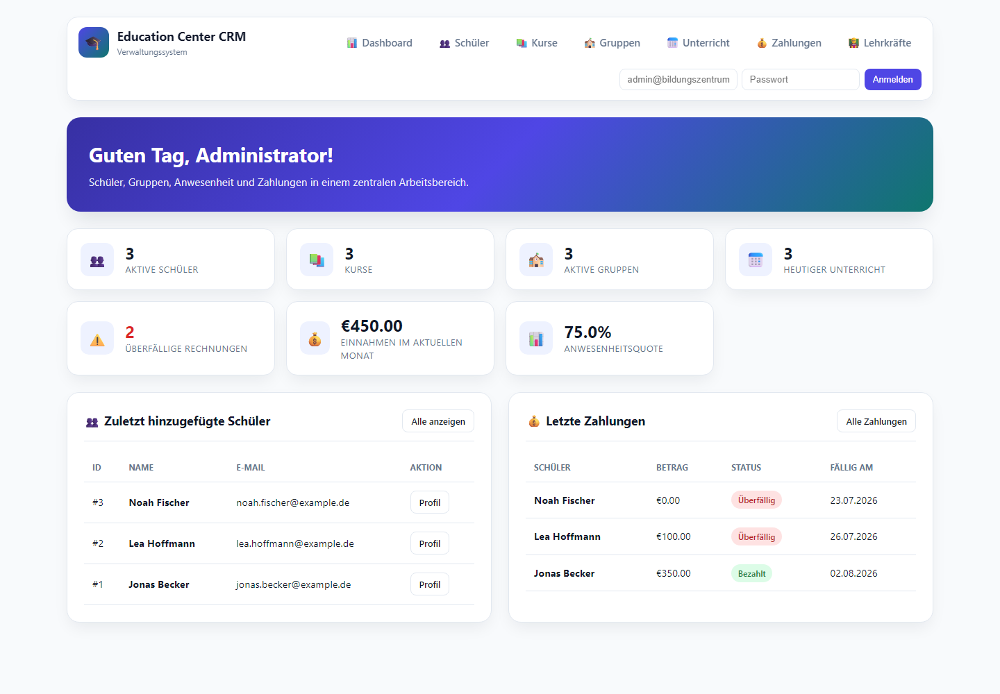

# Education Center CRM



Eine deutschsprachige Flask- und SQLite-Anwendung für die tägliche Verwaltung
eines kleinen Bildungszentrums. Sie verbindet Schüler, Kurse, Gruppen,
Unterricht, Anwesenheit und Zahlungen in einem nachvollziehbaren
administrativen Ablauf.

**Portfolio-Demo:** [Statische Vorschau öffnen](https://sandroabashishvili.github.io/education-center-crm/)

Die GitHub-Pages-Version ist bewusst eine schreibgeschützte Vorschau. Die
vollständige Anwendung mit Anmeldung, Rollen, Formularen und SQLite-Datenbank
läuft lokal.

## Funktionen

- geschützte Anmeldung mit sicherem Werkzeug-Passwort-Hashing
- rollenbasierte Zugriffe für Administrator, Mitarbeiter und Lehrkraft
- Schülerverwaltung mit Suche, Status, Profil und Bearbeitung
- Kurs-, Lehrkraft- und Gruppenverwaltung
- Gruppenzuordnung und Unterrichtsplanung
- Anwesenheit je Unterrichtstermin
- Rechnungen, Teilzahlungen und automatische Überfälligkeit
- zwölf Dashboard-Kennzahlen aus der SQLite-Datenbank
- operative Übersichten für neue Schüler, Zahlungen, Unterrichtstermine und Gruppenauslastung
- direkte Navigation vom Dashboard zu Schülern, Zahlungen, Terminen und Gruppen
- UTF-8-CSV-Exporte für Schüler und Zahlungen
- CSRF-Schutz und serverseitige Eingabevalidierung
- responsive Jinja-Oberfläche mit getrennten Templates, Styles und mobilen Datentabellen
- geprüfte SQLite-Backups und Wiederherstellung
- automatisierte Regressionstests
- kompakte, auf Mobilgeräten einklappbare Navigation
- geprüft mit Flask 3.1.3 sowie automatisierten Mobile-, Tablet- und Accessibility-Scans

## Rollen

| Rolle | Zugriff |
| --- | --- |
| Administrator | vollständige Verwaltung einschließlich Löschvorgängen und Lehrkräften |
| Mitarbeiter | tägliche Verwaltung von Schülern, Kursen, Gruppen, Unterricht und Zahlungen |
| Lehrkraft | eigene Gruppen, Unterrichtstermine und Anwesenheit |

## Lokal starten

```bash
git clone https://github.com/sandroabashishvili/education-center-crm.git
cd education-center-crm
python3 -m venv .venv
source .venv/bin/activate
pip install -r requirements.txt
python app/main.py
```

Danach [http://127.0.0.1:5001/](http://127.0.0.1:5001/) öffnen. Beim ersten
Start wird eine versionierte SQLite-Datenbank mit realistischen Demodaten
angelegt.

### Demo-Konten

| Rolle | E-Mail | Passwort |
| --- | --- | --- |
| Administrator | `admin@bildungszentrum.de` | `admin123` |
| Mitarbeiter | `manager@bildungszentrum.de` | `manager123` |
| Lehrkraft | `teacher@bildungszentrum.de` | `teacher123` |

Diese Zugangsdaten sind ausschließlich für die lokale Portfolio-Demo bestimmt.

## Tests

```bash
python -m unittest discover -s tests -v
```

Die Tests prüfen unter anderem CSRF-Schutz, private Seiten, Passwort-Hashes,
Rollenrechte, Lehrkraft-Sichtbarkeit, Schüler-CRUD, Anwesenheit,
Teilzahlungen, ungültige Formulare, CSV-Exporte sowie Backup und Restore.

## Datenbank sichern und wiederherstellen

```bash
python -m tools.database_cli backup
python -m tools.database_cli restore --from app/backups/education-crm-DATUM.db --confirm
```

Vor jeder Wiederherstellung erstellt das Werkzeug automatisch eine zusätzliche
Sicherung der aktiven Datenbank und prüft die SQLite-Integrität.

## Konfiguration

```bash
export CRM_SECRET_KEY="replace-this-outside-local-demo"
export CRM_DB_PATH="/absolute/path/to/crm.db"
export HOST="127.0.0.1"
export PORT="5001"
```

Weitere Werte stehen in [.env.example](.env.example).

## Architektur

```text
app/
├── main.py              Flask-Konfiguration und Fehlerbehandlung
├── database.py          versioniertes SQLite-Schema und Demodaten
├── models.py            Domain-Dataclasses
├── routes.py            HTTP-Routen, Rollen und Validierung
├── services.py          Datenzugriff und Geschäftsregeln
├── templates/           Jinja-Seitentemplates
├── static/css/app.css   gemeinsame Oberfläche
├── static/js/            responsive Darstellung der Datentabellen
└── utils.py             Parsing- und Validierungshelfer
tests/                   automatisierte Regressionstests
tools/database_cli.py    Backup und Restore
docs/index.html          statische GitHub-Pages-Demo
```

## Status

**Functional Portfolio MVP v1.0 abgeschlossen und verifiziert.**

Die Anwendung ist für eine lokale, realistische Demonstration fertiggestellt.
Die öffentliche GitHub-Pages-Seite ist kein gehostetes Mehrbenutzer-CRM.
Für einen extern betriebenen Produktivdienst wären zusätzlich unter anderem
Passwort-Wiederherstellung, Audit-Logging, geregelte Deployments, ein
Produktions-WSGI-Server und eine betriebliche Datenschutzprüfung erforderlich.

- [Aktueller Stand](docs/current_status.md)
- [Datenmodell](docs/domain_model.md)

## Autor

Sandro Abashishvili

[Portfolio](https://sandroabashishvili.github.io/) ·
[GitHub](https://github.com/sandroabashishvili) ·
[LinkedIn](https://www.linkedin.com/in/aleksandre-abashishvili-03417617a/)
